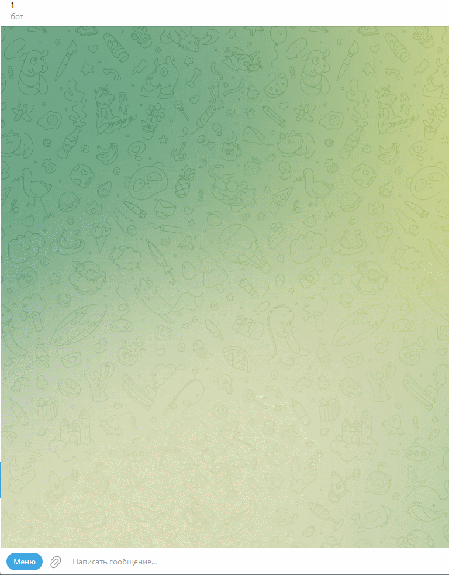

# Боты во вконтакте и в телеграмме, отвечающие на сообщения пользователя, используя DialogFlow

Что такое DialogFlow? Dialogflow (ранее известный как API.AI) - это облачная платформа разработки разговорных интерфейсов, созданная компанией Google. 
Она позволяет разработчикам создавать и интегрировать чат-ботов, виртуальных помощников и другие разговорные интерфейсы в приложения и услуги.

## Прямой запуск

- Скачайте код. Установите зависимости:
```sh
pip install -r requirements.txt
```
- Создайте проект в DialogFlow https://cloud.google.com/dialogflow/es/docs/quick/setup

- Создайте агента в DialogFlow https://cloud.google.com/dialogflow/es/docs/quick/build-agent

- Создайте интенты в DialogFlow https://cloud.google.com/dialogflow/es/docs/quick/build-agent

Что такое DialogFlow? Dialogflow (ранее известный как API.AI) - это облачная платформа разработки разговорных интерфейсов, созданная компанией Google. 
Она позволяет разработчикам создавать и интегрировать чат-ботов, виртуальных помощников и другие разговорные интерфейсы в приложения и услуги.

- Установите Google Cloud SDK https://cloud.google.com/sdk/docs/install

- Выполните команду для авторизации в Google Cloud SDK:
```sh
gcloud auth application-default login
```

- Создайте файл с переменными окружения ".env" и запишите туда данные в таком формате: ПЕРЕМЕННАЯ=значение.

Переменные окружения:
- TELEGRAM_BOT_TOKEN - токен телеграм бота, инструкция по созданию бота: https://medium.com/spidernitt/how-to-create-your-own-telegram-bot-63d1097999b6
- TELEGRAM_TOKEN_FOR_VK_BOT - токен телеграм бота, для vk бота, инструкция по созданию бота: https://medium.com/spidernitt/how-to-create-your-own-telegram-bot-63d1097999b6
- GOOGLE_CLOUD_PROJECT_ID - id проекта dialogflow, инструкция по созданию проекта: https://cloud.google.com/dialogflow/es/docs/quick/setup
- ADMIN_CHAT_ID - id администратора в телеграмме, для отслеживания ошибок, для получения id напишите боту по ссылке: https://telegram.me/userinfobot


Запуск телеграмм бота:
```sh
python tg_bot.py
```

Запуск vk бота:
```sh
python vk_bot.py
```

Бота можно натренировать на свои фразы, для этого есть скрипт learning_script.py, скрипт работает с JSON файлом, в котором хранятся фразы и ответы на них,
Пример такого файла questions.json находится в папке examples_JSON_files_with_text, для запуска скрипта необходимо передать ему путь до файла с фразами и ответами, например:
Стандартно скрипт запускается по умолчанию с файлом questions.json, который находится в папке examples_JSON_files_with_text:

```sh
python learning_script.py
```
Также вы можете передать скрипту путь до файла с фразами и ответами, например:
```sh
python learning_script.py -fp C:\Users\user\Desktop\questions.json
```

Чтобы бот в телеграмме начал вам отвечать, необходимо отправить ему любое сообщение.

Сслыка на телеграмм бота: https://t.me/lolkekazazaBot

!

Ссылка на бота в вк: https://vk.com/im?sel=c1


## Цели проекта

Код написан в образовательных целях на онлайн-курсе для веб-разработчиков [Devman](https://dvmn.org).
